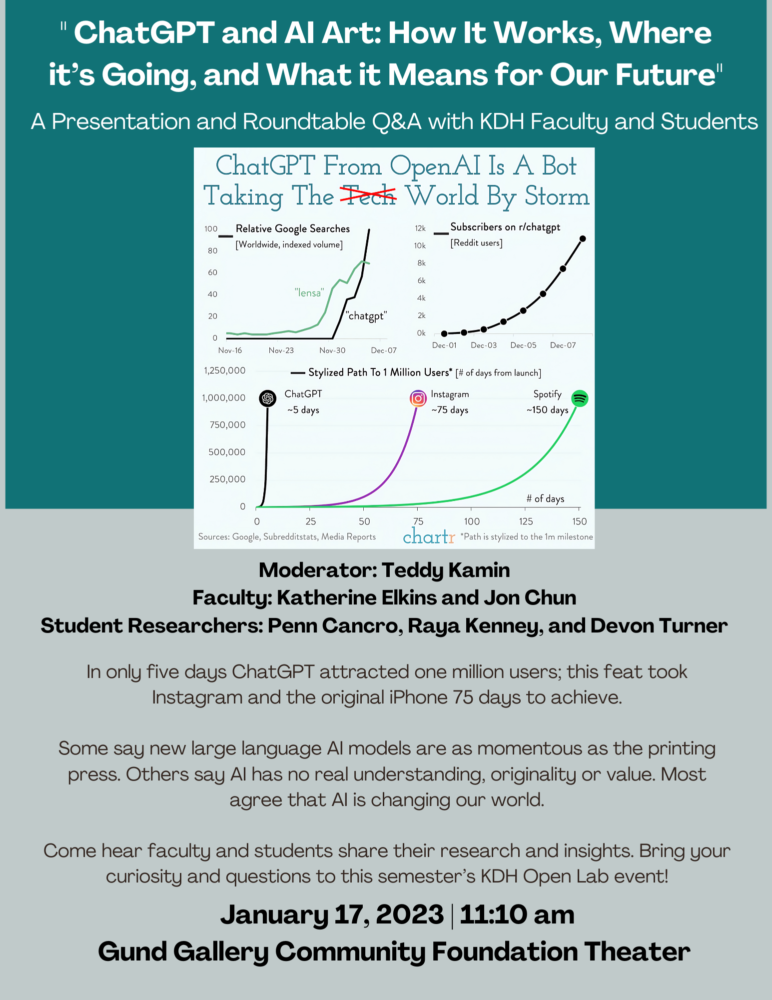

 
&nbsp;
 

Artificial Intelligence models that can generate writing and art have exploded into the public consciousness faster than any previous technology. Within only 5 days <a href="https://openai.com/blog/chatgpt/">ChatGPT</a> attracted one million users, a feat that took DALL-E, Instagram and the original iPhone each approximately 75 days to achieve.

A stream of constantly improving AI models and new startups claim to automate writing and art. Text generation models write essays, screenplays, books, translations, software, poems, lyrics, social media posts, etc. as well as offer search, recommendations and therapy within an informal chat interface. 

Art generation models like <a href="https://openai.com/dall-e-2/">DALL-E 2</a>, <a href="https://midjourney.com/home/?callbackUrl=%2Fapp%2F">Midjourney</a> and Stable Diffusion by <a href="https://stability.ai/">StabilityAI</a> create images (and soon video) of virtually any composition in any style, artists or period. AI art models currently generate story illustrations, stock photography, commercial artwork, website UX and industrial designs like new products, fashions and furniture.

Skeptics claim these models are fundamentally flawed: pale imitations of human creations, easily detectable frauds, confidently wrong, dangerously inaccurate and intellectual theft. Are they simply ‘***stochastic parrots***’ with no real understanding, originality or value? Non-skeptics worry about the direct impact on artists, designers, writers, programmers and others as well as the indirect impact on social institutions like education and public trust.

Come to our Roundtable to discuss:

* The Basics of Generative AI Models
* Current state-of-the-art capabilities and limitations
* Research & Future Developments
* Student Research Projects
* Impact On Higher Education (e.g. plagiarism detection and new pedagogies) 

Prof Katherine Elkins has published on literature, philosophy and aesthetics and, together with Jon Chun, has published some of the earliest work on generative AI in the Digital Humanities. They will be joined by students from a variety of disciplines who have used these AI models for a variety of IPHS AI DH projects from writing film beat sheets to exploring generative art.

Bring your curiosity, skepticism and concerns to this community event sponsored by the AI DHColab. 

&nbsp;
# **Contents**
* <a href="#generative-ai">Generative AI</a>
* <a href="#chat">ChatGPT Prompt Engineering</a>
* <a href="">GPT Plagiarism Detection</a>
* <a href="#gpt-plagiarisim-evasion">GPT Plagiarism Evasion</a>
* <a href="#gpt-and-the-death-of-the-essay">GPT and the Death of the Essay</a>
* <a href="#ai-art-galleries">AI Art Galleries</a>
* <a href="#ai-art-communities">AI Art Communities</a>
* <a href="#ai-art-prompt-engineering">AI Art Prompt Engineering</a>
* <a href="#stable-diffusion">Stable Diffusion</a>
* <a href="#sample-ai-applications">Sample AI Applications</a>
* <a href="#disrupted-services">Disrupted Services</a>
* <a href="#generative-ai-lawsuits">Generative AI Lawsuits</a>
* <a href="#try-for-free">Try for Free</a>
* <a href="#hosting">Hosting</a>

---
# **References**

### **Generative AI**
* <a href="https://github.com/steven2358/awesome-generative-ai">Awesome Generative AI</a>

### **ChatGPT Prompt Engineering**
* <a href="https://github.com/openai/openai-cookbook">OpenAI Prompt Cookbook</a>
* <a href="https://github.com/f/awesome-chatgpt-prompts">f/awesome-chatgpt-prompts</a>
* <a href="https://github.com/thunlp/PromptPapers">Prompt Research Papers</a>
* <a href="https://chat.openai.com/auth/login?next=%2Fchat">ChatGPT</a>

### **GPT Plagiarism Detection**
* <a href="https://www.zdnet.com/article/can-ai-detectors-save-us-from-chatgpt-i-tried-3-online-tools-to-find-out/">Can AI Detectors Save Us From ChatGPT?</a> (13 Jan 2023)
* <a href="http://gltr.io/dist/index.html">Giant Language model Test Room</a>
* <a href="https://openai-openai-detector.hf.space/">Huggingface OpenAI Detector</a>
* <a href="http://gptzero.me/">GPTZero.me</a>
* <a herf="https://www.newscientist.com/article/2350655-openai-is-developing-a-watermark-to-identify-work-from-its-gpt-text-ai/">OpenAI GPT Watermark</a>
* <a href="https://originality.ai/">originality.ai</a> (paid)
* <a href="https://www.turnitin.com/blog/sneak-preview-of-turnitins-ai-writing-and-chatgpt-detection-capability">TurnItIn.com</a> (paid)

### **GPT Plagiarism Evasion**
* <a href="http://www.trywordai.com">TryWordAI.com</a> (paid)
* and many more free alternatives

### **GPT and the Death of the Essay**
* <a href="https://www.theatlantic.com/technology/archive/2022/12/chatgpt-ai-writing-college-student-essays/672371/">The College Essay is Dead</a> by Stephen Marche, The Atlantic, Dec 6th, 2023
* <a href="https://arxiv.org/abs/2212.11661">The Death of the Short-Form Physics Essay in the Coming AI Revolution (Dec 22th)</a>
* <a href="https://arxiv.org/abs/2212.09292">ChatGPT: The End of Online Exam Integrity? (Dec 19th)</a>
* <a href="https://arxiv.org/abs/2206.05442">Automatically Answering and Generating Machine Learning Final Exams (Jun 11th)</a>

>
### **AI Art Galleries**
* <a href="https://lexica.art/">https://lexica.art/</a>
* <a href="https://openart.ai/">https://openart.ai/</a>
* <a href="https://www.midjourney.com/showcase/recent/">https://www.midjourney.com/showcase/recent/</a>

### **AI Art Communities**
* <a href="https://www.youtube.com/watch?v=o09F6TViIGk">The End of Original Art? Current Issues with AI Art and Ethics</a>
* <a href="https://aiartists.org/">https://aiartists.org/</a>
* <a href="https://www.artaigallery.com/">https://www.artaigallery.com/</a>

### **AI Art Prompt Engineering**
* <a href="https://openart.ai/promptbook">Stable Diffusion Prompt Book</a> by OpenArt.ai
* <a href="https://strikingloo.github.io/DALL-E-2-prompt-guide">DALL-E 2 Prompt Guide</a> by Strikingloo
* <a href="https://dallery.gallery/the-dalle-2-prompt-book/">DALL-E Guide</a> by dallery.gallery

### **Stable Diffusion**
* <a href="https://stability.ai/blog/stable-diffusion-public-release">Stable Diffusion (by stability.ai)</a>
* <a href="https://civitai.com/">CivitAt Model Hub</a>
* <a href="https://www.youtube.com/watch?v=HAR6LjzTg5k">Video</a> on Protogen Models:
  - <a href="https://civitai.com/models/3627/protogen-v22-official-release">v2.2 (Anime)</a> vs 
  - <a href="https://civitai.com/models/3666/protogen-x34-official-release">x3.4 (Photorealism)</a>
  -  with <a href="https://miro.com/app/board/uXjVP1DfqDg=/?share_link_id=306860251792">Miro Board Notes</a>
* <a href="https://civitai.com/models/86/openjourney-aka-midjourney-v4">OpenJourney Model</a>

### **Sample AI Applications**
* <a href="https://www.youtube.com/watch?v=ZFQ1WufLWwo">Midjourncy Designs a Shopify Website</a>
* <a href="https://www.youtube.com/watch?v=aCVL9qz6IV0">Augment Blender 3D Design/Game Assets</a>
* <a href="https://www.youtube.com/watch?v=K0cmmKPklp4">ChatGPT Takes an Astrophysics Exam</a>
* <a href="https://www.youtube.com/watch?v=OV88YP34O8U">(One-shot) Midjourney Illustrates of a story written by ChatGPT, Narrated by Adobe</a> 
* <a href="https://github.com/fauxpilot/fauxpilot">Write code</a>
* <a href="https://qantarot.substack.com/p/chatgpt-and-galactica-are-taking     ">Write academic research papers</a>
* <a href="https://twitter.com/hausman_k/status/1613544838900903937">Embodied AI (LLM + Robotics)</a>

### **Disrupted Services**
* <a href="">Google</a>
* <a href="https://www.youtube.com/watch?v=IbDAmvUwo5c">Stack Overflow</a>
* <a href="">Getty Images</a>
### **Generative AI Lawsuits**
* <a href="https://stablediffusionlitigation.com/">Stable Diffusion</a> (Generative Art)
* <a href="https://githubcopilotlitigation.com/">Copilot</a> (Generative Code)
### **Try for Free** (as of 14 Jan 2023)
* <a href="https://chat.openai.com">Open AI ChatGPT</a>
* <a href="https://playgroundai.com/">PalyGroundAI.com</a>
* <a href="https://lexica.art/">Lexica.art</a>
* <a href="https://www.bluewillow.ai/">BlueWillow.ai</a>

### **Hosting**

* 
* <a href="https://www.runpod.io">RunPod.io</a>

---
**Integrated Program for Humane Studies**
* <a href="https://www.kenyon.edu/academics/departments-and-majors/integrated-program-in-humane-studies/">IPHS Home</a>
* <a href="https://www.kenyon.edu/digital-humanities/">Digital Humanities</a>
* <a href="https://digital.kenyon.edu/dh/">Student AI DH Research</a>
* <a href="https://www.kenyon.edu/digital-humanities/courses/">IPHS DH Curriculum</a>

 
&nbsp;

# **Student Panelist** 
---
### AI Research Projects for IPHS200 Programming Humanity (Fall 2022)

&nbsp;

**Penn Cancro**
 
ChatGPT and Education: A Guide for Educators and a Look Towards the Future (***Pending***)
 
&nbsp;
 
**Alina Kalmeyer**
 
<a href="https://digital.kenyon.edu/dh_iphs_prog/61/">Do Androids Dream of Digital Art? Addressing the Spectrum of Perspectives on AI-Generated Artwork</a>
 
&nbsp;
 
**Raya Kenney**
 
<a href="https://digital.kenyon.edu/dh_iphs_prog/53/">Adjectivally-Oriented: Women Through the Decades Stylistic Shifts In Magazines As Represented By Image-Generating AI</a>
 
&nbsp;
 
**Graham O'Brien**
 
Examining Race using AI: AI Generated Images of Black and White Women's Hair (***Pending***)
 
&nbsp;
 
**Devon Turner**
 
<a href="https://digital.kenyon.edu/dh_iphs_ss/18/">When AI Meet Screenwriting: Can AI Generate Beat Sheets and Storyboards?</a>

 
&nbsp;
 

# **AI DHColab IPHS Faculty** 
---
<strong>Kathrine Elkins</strong>
 
<a href="https://www.kenyon.edu/directory/kate-elkins/" rel="nofollow">Website</a>
 

When she was nine years old, Katherine Elkins started a family-run software company called Alcazar Associates with her father and brother. The company sold the first ever typing tutor as well as the first Star Wars video game. Her brother went on to work in AI at MIT, DragonSpeak, Batelle and Toyota Research. She went on to become a scholar of cognition, consciousness, and aesthetic experience with over a dozen published essays and two published books. She now also works in the “family business” of AI alongside Jon Chun, her husband. Together, they were the first to publish a method for surfacing the emotional arcs of stories. They were also some of the first to research and publish on AI language generation, and she speaks publicly about AI, most recently in an interview with UC Berkeley’s Cindy Mason on Radio AI. In her free time, she consults for both government and industry on AI and large language models like ChatGP, and this April she will help lead a workshop at Dartmouth’s Neukom Institute of Computational Science.  

&nbsp;

<strong>Jon Chun</strong>
 
<a href="https://github.com/jon-chun">Website</a>
 

Jon Chun has undergraduate and graduate degrees in Computer Science and Electrical Engineering from UC Berkeley and UT Austin. He has done postgraduate fellowships and NSF research in gene therapy, electronic medical records, and semiconductors at the University of Iowa Medical School, MIT and SEMATECH. After working in large organizations including national labs, finance, and insurance, he co-founded startups in Japan, Brazil and Silicon Valley. He co-authored patents at his last startup to build the world’s largest privacy/anonymity service and designed the first web-based VPN linux appliance.  Immediately prior to coming to Kenyon, he was a Fortune 500 Director of Development for the world’s largest computer security company, entrepreneur in residence at UC Berkeley and judged startup competitions at Berkeley Engineering Graduate School and OSU. 

&nbsp;
 
In 2020 he and Katherine Elkins published "Can GPT-3 pass a Writer’s Turing Test?" in the Journal of Cultural Analytics; one of the first critical reviews of generative AI with 60 academic citations currently. Last year they published "What the Rise of AI Means for Narrative Studies: A Response to ‘Why Computers Will Never Read (or Write) Literature’ by Angus Fletcher." in Narrative. He gave the first presentation on GPT-2 at the Narrative Conference in 2020 and this March is presenting “Augmenting Narrative Generation with Visual Imagery Using Integrated Prompt Engineering (ChatGPT, DALL-E 2)” at Narrative 2023. His 2023 article "Exploring the Black Box: Narrative XAI (eXplainable AI)" will appear in the International Journal of Digital Humanities (IJDH) 2023 Special Issue on "Reproducibility and Explainability in Digital Humanities".

&nbsp;

<a href="https://www.zdnet.com/article/can-ai-detectors-save-us-from-chatgpt-i-tried-3-online-tools-to-find-out/">Can AI Detectors Save Us From ChatGPT? (13 Jan 2023)</a>

 
&nbsp;
 

<a href="https://www.deviantart.com/1995express/art/A-I-is-theft-941088405">Explaination and Credit</a>

 
&nbsp;
 

<a href="https://aiartists.org/ai-generated-art-tools">AI Generated Art Tools</a>
 
&nbsp;
 

<a href="#ai-art-galleries">AI Art Galleries</a>

 
&nbsp;
 

<a href="https://chat.openai.com">Open AI ChatGPT</a>

 
&nbsp;
 

<a href="http://gltr.io/">IBM/MIT-Harvard NLP GianT Language test Room (GTLR)</a>

 
&nbsp;
 

<a href="https://www.sequoiacap.com/article/generative-ai-a-creative-new-world/">Sequoia Capital: Generative AI, A creative new world</a>

 
&nbsp;
 

