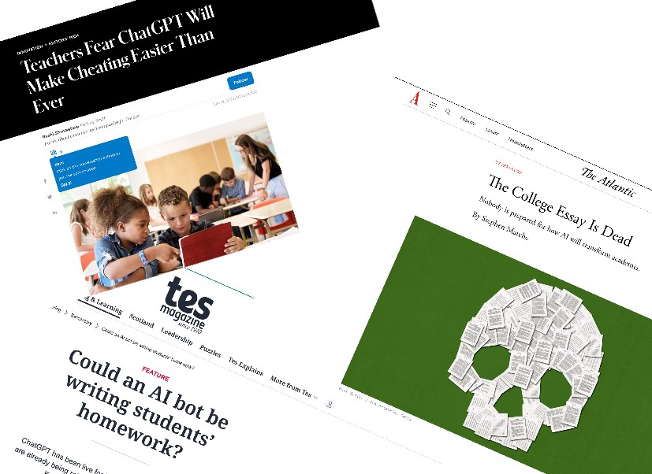
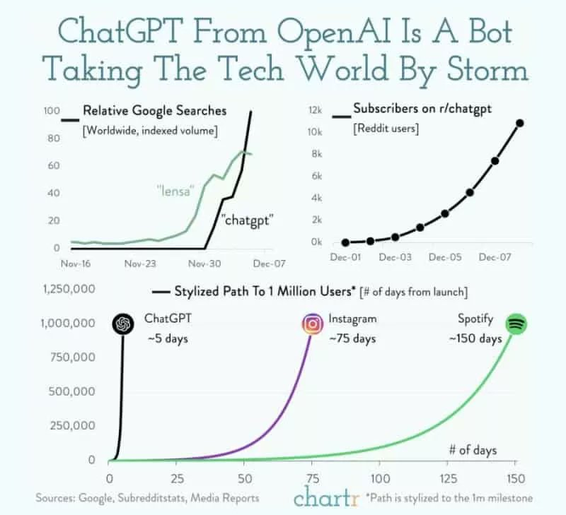
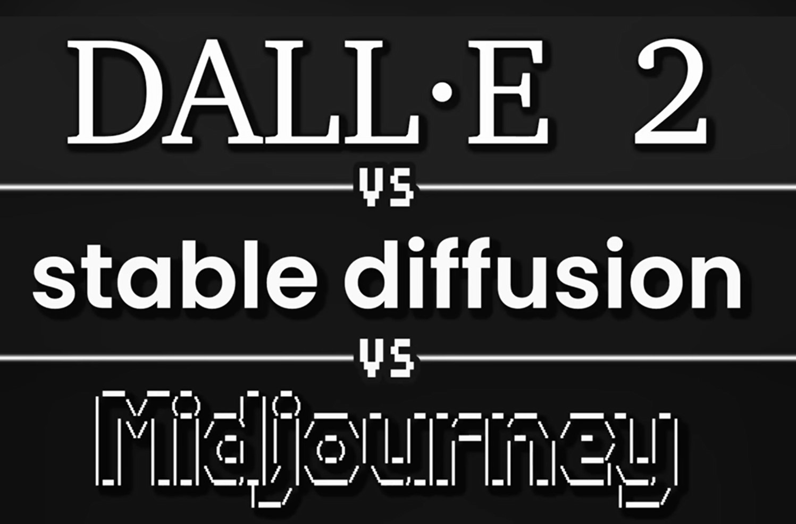
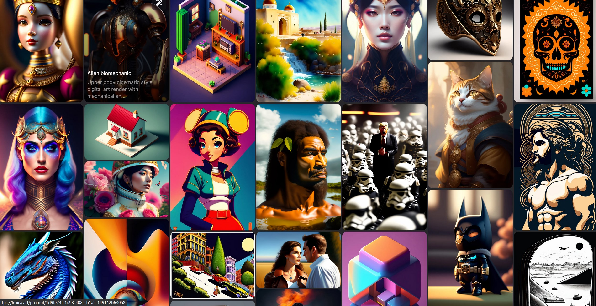
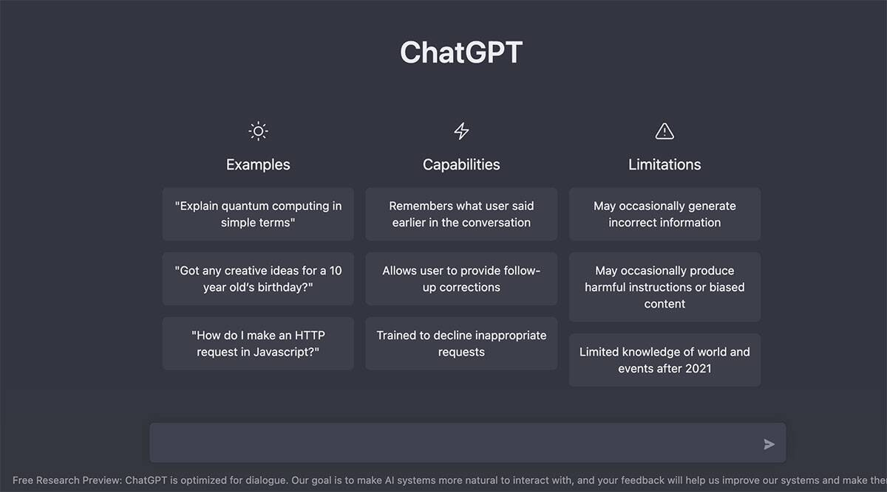
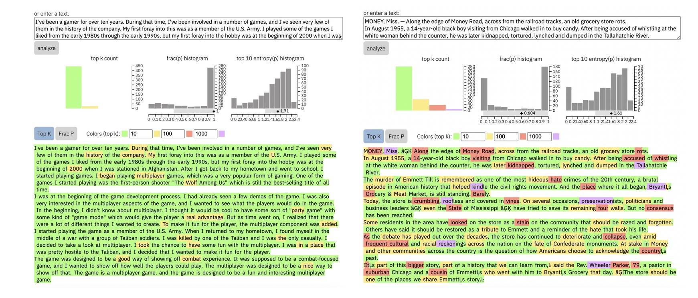
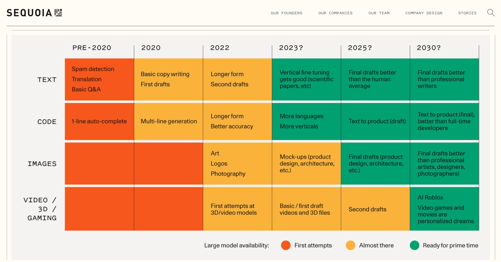

# **How Writing and Art Generative AI Models Work and Will Change Education**

### An IPHS Faculty/Student Roundtable sponsored by the AI DHColab
### Kenyon College, Jan 2023

 
&nbsp;
 

 

Artificial Intelligence models that can generate writing and art have exploded into the public consciousness faster than any previous technology. Within only 5 days <a href="https://openai.com/blog/chatgpt/">ChatGPT</a> attracted one million users, a feat that took DALL-E, Instagram and the original iPhone each approximately 75 days to achieve.

A stream of constantly improving AI models and new startups claim to automate writing and art. Text generation models write essays, screenplays, books, translations, software, poems, lyrics, social media posts, etc. as well as offer search, recommendations and therapy within an informal chat interface. 

Art generation models like <a href="https://openai.com/dall-e-2/">DALL-E 2</a>, <a href="https://midjourney.com/home/?callbackUrl=%2Fapp%2F">Midjourney</a> and Stable Diffusion by <a href="https://stability.ai/">StabilityAI</a> create images (and soon video) of virtually any composition in any style, artists or period. AI art models currently generate story illustrations, stock photography, commercial artwork, website UX and industrial designs like new products, fashions and furniture.

Skeptics claim these models are fundamentally flawed: pale imitations of human creations, easily detectable frauds, confidently wrong, dangerously inaccurate and intellectual theft. Are they simply ‘***stochastic parrots***’ with no real understanding, originality or value? Non-skeptics worry about the direct impact on artists, designers, writers, programmers and others as well as the indirect impact on social institutions like education and public trust.

Come to our Roundtable to discuss:

* The Basics of Generative AI Models
* Current state-of-the-art capabilities and limitations
* Research & Future Developments
* Student Research Projects
* Impact On Higher Education (e.g. plagiarism detection and new pedagogies) 

Prof Katherine Elkins has published on literature, philosophy and aesthetics and, together with Jon Chun, has published some of the earliest work on generative AI in the Digital Humanities. They will be joined by students from a variety of disciplines who have used these AI models for a variety of IPHS AI DH projects from writing film beat sheets to exploring generative art.

Bring your curiosity, skepticism and concerns to this community event sponsored by the AI DHColab. 

**References**
* Coming...

**Integrated Program for Humane Studies**
* <a href="https://www.kenyon.edu/academics/departments-and-majors/integrated-program-in-humane-studies/">IPHS Home</a>
* <a href="https://www.kenyon.edu/digital-humanities/">Digital Humanities</a>
* <a href="https://digital.kenyon.edu/dh/">Student AI DH Research</a>
* <a href="https://www.kenyon.edu/digital-humanities/courses/">IPHS DH Curriculum</a>

**Kathrine Elkins**
 
<a href="https://www.kenyon.edu/directory/kate-elkins/">Website</a>
 

**Jon Chun**
 
<a href="https://github.com/jon-chun">Website</a>
 

 
&nbsp;
 

 
&nbsp;
 

 
&nbsp;
 

 
&nbsp;
 

 
&nbsp;
 

 
&nbsp;
 

 
&nbsp;
 

